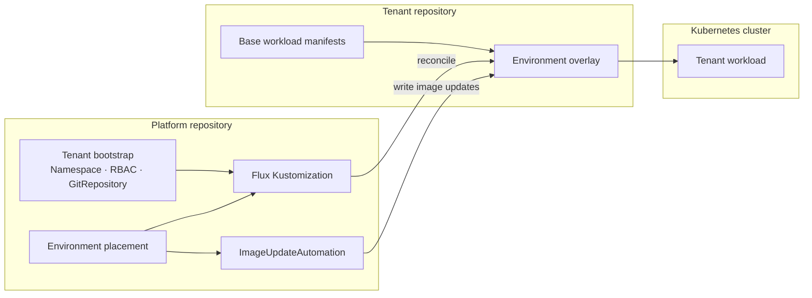

# flux2-example-tenants

A simplified extract from a working FluxCD configuration demonstrating a multi-tenant GitOps deployment model.

The example separates **platform ownership**, **tenant ownership**, and **environment placement**. The platform connects tenants to clusters without taking ownership of their application state.

## Architecture

### Responsibility boundaries

**Platform repository**

- creates tenant namespaces, reconciliation identities, and RBAC boundaries;
- connects tenant Git repositories to Flux;
- selects which tenant workload and environment projection are deployed to a cluster;
- configures reconciliation and image automation.

**Tenant repository**

- owns deployable application state;
- contains base workload manifests and environment-specific overlays;
- receives automated image updates as Git commits.

**Flux**

- reconciles the selected tenant state into the target cluster;
- performs reconciliation using the tenant identity;
- writes automated image changes back to the corresponding environment overlay.

In other words:

> **The tenant owns what is deployed, the platform owns where it is deployed, and Flux owns convergence.**

## Reconciliation flow

1. The platform creates a tenant-scoped `GitRepository` and the required reconciliation identity.
2. The environment configuration selects a path from the tenant repository.
3. A Flux `Kustomization` reconciles that path into the cluster using the tenant identity.
4. `ImageUpdateAutomation` writes image updates back to the same environment-specific path.
5. The resulting Git state is reconciled again by Flux.

This keeps **workload ownership independent from workload placement**: a tenant repository does not need to know which cluster consumes its manifests, while the platform does not need to own the application's desired state.

## Example repositories

This example uses the following repositories:

- Tenant: https://github.com/DmitriySafronov/flux2-tenant-dummy-apps
- Frontend: https://github.com/DmitriySafronov/dummy-frontend
- Backend: https://github.com/DmitriySafronov/dummy-backend

## References

- FluxCD multi-tenancy example: https://github.com/fluxcd/flux2-multi-tenancy
- FluxCD multi-tenancy documentation: https://fluxcd.io/flux/installation/configuration/multitenancy/

## Scope

This repository is intentionally limited in scope. It is not a complete Kubernetes platform or a production-ready FluxCD installation.

It is a reduced example extracted from a larger working configuration, with unrelated infrastructure and application-specific details removed to make the tenant integration model easier to inspect.
